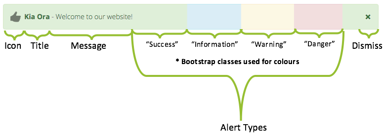

## Easily create, manage and display announcements/alerts to users

This block allows users to display messages, announcements etc, which are Bootstrap-based, allowing for various configurations.
This could be useful in cases such as alerting users of scheduled outages, welcoming them to your site, teachers can use it to notify users of changes/due dates, etc.

### Features:

* Customisable title & message
* Basic HTML tags allowed for advanced users
* Multi-lingual/filter support
* Multiple types of announcements (Bootstrap-based styles) (Information type set to no background colour but this can be changed in CSS)
* Type-based icons (optional setting)
* Dismissible/Non-Dismissible
* Customisable date range to show announcements
* Display a announcement to the user a set amount of times
* Currently only on the my pages e.g. Dashboard
* Cna set the target audience to see the messages (staff/student/all)
* Enable/Disable a/all announcements
* Edit/Delete/Restore announcements
* Option to auto-delete announcement after end date (This is via the scheduled task)
* Option to permanently delete announcements that's had the deleted flag for more than 30 days (via scheduled task)
* Option to automatically remove user (dismissed/seen) records that relates to announcements that don't exist anymore (via scheduled task)
* AJAX used to improve user-experience and simplify processes
* Live-preview when adding/editing a announcement
* Title and message characters can also be limited in the settings
* Implements Privacy API (GDPR Compliance)
* Only users with the following capabilities can manage the messages [block/marketing_messages:manageannouncements and block/marketing_messages:manageownannouncements] 

#### Notification Anatomy

  but the information now has no bacground colour.

#### Installation Notice

All the plugin's settings are disabled by default. Enable it upon installation if you wish to start using it immediately or enable it later by navigating to Site Administration > Plugins > Blocks > Marketing Messages. 

#### Backwards Compatibility/Progressive Enhancement

Although the plugin works and is usable without JavaScript, it is highly recommended to use the plugin with JavaScript enabled.
Using the plugin with JavaScript disabled does not allow for some features to be used to their full potential ranging from dismissing a announcement to dynamically editing existing announcements and the live-preview feature - all of which relies on JavaScript in some form to make the user's experience more enjoyable.

